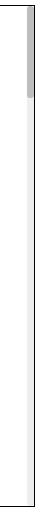
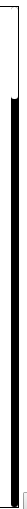

# vue-scroll插件 1.0.5


> 适用于vue2.0以上的滚动组件，自定义滚动条样式，美观简单易用，解决浏览器样式不兼容问题

### 使用方法
```javascript
npm install vue-hp-scroll --S

在main.js中引入

import VueScroll from 'vue-hp-scroll'
Vue.use(VueScroll)
```

> 在页面中使用

```html
<vue-scroll></vue-scroll>
```

> 示例

 默认样式  自定义样式


### 属性

属性 | type | Explain
---- | ---- | ----
y | Number | 滚动条位置
maxScrollY | Number | 最大滚动位置
contentHeight | Number | 内容区域高度
wrapperHeight | Number | 包裹区域高度

### props取值

属性 | type | required | Explain 
---- | ---- | ---- | ----
data | Number，Array，Object | false | 监听数据变化
width | String | true | scroll宽度
height | String | true | scroll高度
isTrackY | Boolean | false | 是否显示y轴滚动条
TrackSize | Number | false | 滑块容器宽度
TrackYstyle | Object | false | 滑块样式
WrapperTrack | Object | false | 滑块容器样式

样式绑定同style绑定

使用
```html
<vue-scroll :isTrackY="true" height="500px" width="100px" >
    <div class="content">
    </div>
</vue-scroll>
```

### 事件

event | 触发 | 参数
---- | ---- | ---- 
scroll | scroll滚动时触发 | e
scrollStart | scroll滚动开始触发 | e
scrollEnd | scroll滚动结束触发 | e
scrollBottom | scroll滚动到底部触发 | e
scrollTop | scroll滚动到顶部触发 | e

使用
```html
<vue-scroll @scroll=" " @scrollStart="" height="500px" width="100px" >
    <div class="content">
    </div>
</vue-scroll>
```

### 方法

方法 | 参数 | 说明
---- | ---- | ---- 
scrollTo | val | 参数指移动到指定位置

使用
```html
<vue-scroll ref="scroll" height="500px" width="100px" >
    <div class="content">
    </div>
</vue-scroll>
var val = 20
this.$refs.scroll.scrollTo(val)
```